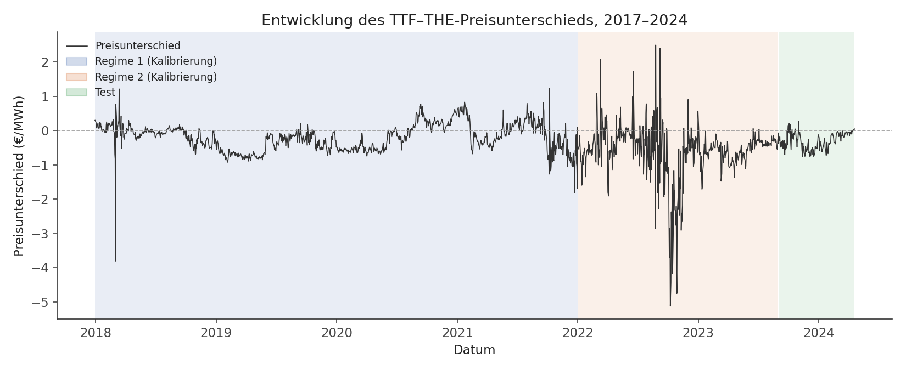
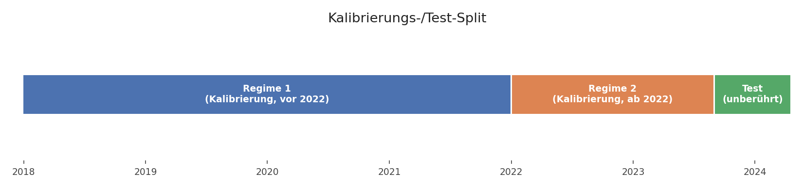
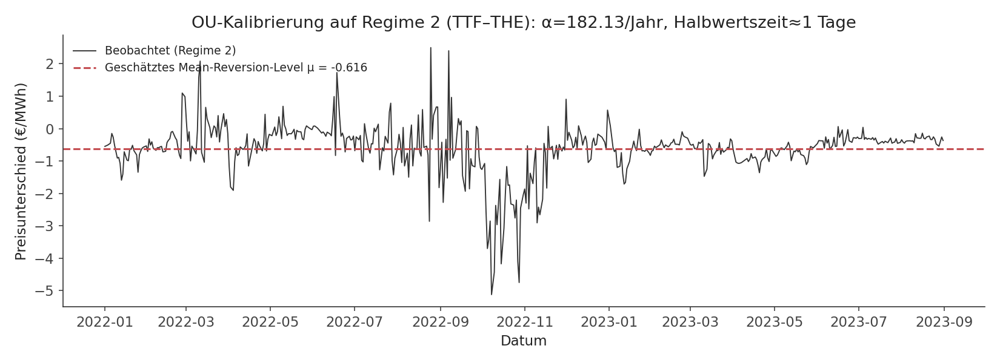
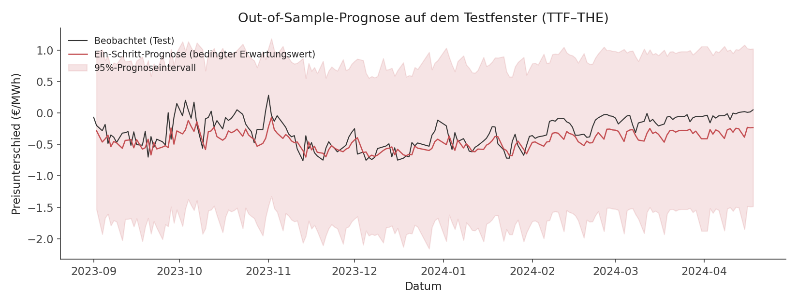
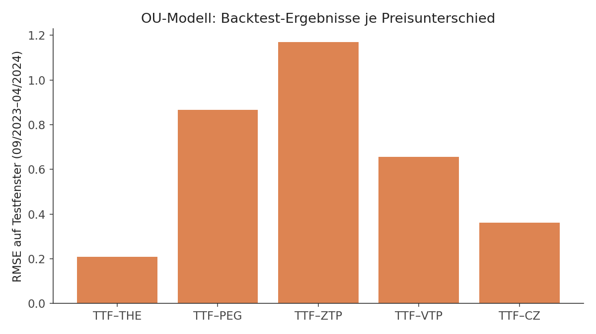

# Modeling European Natural Gas Price Differences
## Ornstein-Uhlenbeck-Modell

Eine End-to-End-Pipeline zur Modellierung von Preisunterschieden zwischen
europäischen Gas-Hubs mit einem Ornstein-Uhlenbeck-Prozess: Kalibrierung
auf realen Marktdaten, Out-of-Sample-Backtesting und Bewertung der
zugrundeliegenden Transportkapazität als Optionsstrip.



## 1. Project Overview

Das Projekt modelliert, wie sich der Preisunterschied zwischen dem
niederländischen TTF-Hub und vier weiteren europäischen Gas-Hubs (THE,
PEG, ZTP, VTP AUT, CZ) über die Zeit verhält, und nutzt dieses Modell für
zwei Anwendungen: (1) eine Out-of-Sample-Prognose des Preisunterschieds
und (2) die Bewertung einer Gastransport-Kapazität zwischen zwei Märkten
als Optionsstrip auf diesen Preisunterschied.

## 2. Research Question

Lässt sich der Preisunterschied zwischen zwei gekoppelten, aber nicht
identischen Gas-Märkten als mean-reversion-artiger stochastischer Prozess
beschreiben — und wie gut trifft ein auf einem Kalibrierungszeitraum
geschätztes Modell den tatsächlichen Verlauf auf einem strikt getrennten,
späteren Testzeitraum?

## 3. Data

Rohdaten: tägliche Preisreihen von sechs europäischen Gas-Hubs (TTF, THE,
PEG, ZTP, VTP AUT, CZ), öffentlich zugängliche Marktpreise, Zeitraum
2017-12-30 bis 2024-04-18. Die Preise liegen (quasi) täglich Montag–Samstag
vor; der Samstagspreis vertritt de facto das gesamte Wochenende (Sonntag
wird nicht separat notiert). Die strukturell gebrochenen Marktgebiets-Paare
THE/NCG und PEG/PEGN (Marktgebietsfusionen 2018 bzw. 2021) werden zu
durchgängigen Serien zusammengeführt.

CZ fehlt vor 2019-01-03 vollständig (Marktgebiet erst ab diesem Datum
notiert, ca. 16 % fehlende Werte über die gesamte Historie); die übrigen
Preissäulen sind praktisch vollständig (< 0,3 % fehlend).

Aus den Rohpreisen werden fünf Preisunterschiede berechnet (TTF minus
jeweiliger Hub). Details zur Datenaufbereitung: `src/data.py`.

## 4. Methodology

### 4.1 Price Differences

Für jeden Hub X wird der Preisunterschied als `TTF − X` berechnet (siehe
`src/data.py`, `PRICE_DIFFERENCE_DEFINITIONS`). Ein positiver Wert
bedeutet, dass TTF teurer notiert als der Ziel-Hub.

### 4.2 Ornstein-Uhlenbeck-Prozess

Modelliert wird jeder Preisunterschied als kontinuierlicher
Mean-Reversion-Prozess:

```
dX_t = α(θ − X_t)dt + σ dW_t
```

- **α** — Mean-Reversion-Geschwindigkeit: wie schnell der Prozess zu
  seinem langfristigen Niveau zurückkehrt.
- **θ** — langfristiges Gleichgewichtsniveau, zu dem der Preisunterschied
  tendiert.
- **σ** — Volatilität des Prozesses.
- **W_t** — Standard-Wiener-Prozess (Brownsche Bewegung).

Ökonomische Intuition: Zwei über Pipelines gekoppelte Gasmärkte können
sich kurzfristig auseinanderbewegen (z. B. durch lokale Nachfrage- oder
Kapazitätsschocks), aber Arbitrage- und Transportmöglichkeiten ziehen den
Preisunterschied tendenziell wieder zu einem strukturellen Niveau zurück,
das im Wesentlichen die Transportkosten/-kapazität zwischen den Märkten
widerspiegelt.

### 4.3 Parameter Estimation

Die Rohdaten liegen mit unregelmäßigen Beobachtungsabständen vor (mal 1,
mal 2 Kalendertage übers Wochenende). Eine einzelne feste
Zeitschritt-Konvention (z. B. `dt = 1/252` für Handelstage oder
`dt = 1/365` für Kalendertage) würde diese Unregelmäßigkeit verschleiern
und die Parameter systematisch verzerren.

`src/ou_model.py` schätzt daher mit einem **pro Beobachtungsschritt
variablen `dt_i`**, berechnet aus dem tatsächlichen Kalenderdatumsabstand,
über die exakte Gauß'sche Transitionsdichte des OU-Prozesses per
Maximum-Likelihood (`estimate_ou_params()`) — keine Näherung durch eine
gewöhnliche AR(1)-OLS-Regression, die ein konstantes `dt` voraussetzt.
Startwerte für den Optimierer stammen aus einer einfachen OLS-Näherung,
das eigentliche Ergebnis kommt aus der exakten MLE.

Jede Schätzung gibt automatisch zwei Diagnose-Kennzahlen zurück:
Jarque-Bera (Normalität der Residuen) und Ljung-Box (Unabhängigkeit der
Residuen, manuell implementiert, siehe `src/ou_model.py`). Details zu den
Ergebnissen unter Punkt 6.

### 4.4 Simulation

Für Optionsbewertung und Transportkapazitäts-Bewertung wird der
kalibrierte OU-Prozess per Euler-Maruyama mit konstantem `dt` simuliert
(`src/simulation.py`, `simulate_ou_paths()`) — die irregulär-dt-Behandlung
betrifft nur die Parameterschätzung, für die Simulation selbst genügt ein
einheitliches Zeitraster. Eine Monte-Carlo-Bewertung eines
Bachelier-Style-Calls auf den Preisunterschied sowie eine bidirektionale
Bewertung der zugrundeliegenden Transportkapazität als Optionsstrip
(empirisch und simulationsbasiert, mit identischer Diskontierung) sind
ebenfalls implementiert.

## 5. Backtesting Framework

```
Rohdaten
   ↓
Preisunterschiede berechnen
   ↓
Split: Regime 1 / Regime 2 (Kalibrierung) / Test
   ↓
OU-Parameterschätzung (nur auf dem Kalibrierungszeitraum)
   ↓
Bedingte Verteilung (Ein-Schritt-Prognose)
   ↓
Out-of-Sample-Bewertung auf dem Testfenster
   ↓
Performance-Metriken (RMSE, MAE, Residualdiagnostik)
```

**Zeitliche Aufteilung** — die Preisunterschiede haben sich infolge des
russischen Angriffskriegs gegen die Ukraine (Februar 2022) strukturell
verändert; eine einzelne durchgängige Kalibrierung würde Vorkriegs- und
Nachkriegsdynamik vermischen:

| Zeitraum | Zweck |
|---|---|
| 2017-12-30 – 2021-12-31 | Regime 1: Kalibrierung vor dem Angriffskrieg |
| 2022-01-01 – 2023-08-31 | Regime 2: Kalibrierung nach Kriegsbeginn |
| 2023-09-01 – 2024-04-18 | Test: unberührter Holdout |



Die Parameter werden ausschließlich mit Informationen aus dem jeweiligen
Kalibrierungszeitraum geschätzt; das Testfenster wird in keinem Schritt
der Kalibrierung angesehen. Da das OU-Modell keine Hyperparameter besitzt,
die zusätzlich auf einem separaten Validierungsfenster gewählt werden
müssten, bleibt der Split auf Kalibrierung + Test beschränkt — kein
Look-Ahead-Bias-Risiko durch eine dritte, vermischte Stufe.

## 6. Results





Kalibrierung auf Regime 2 (2022-01-01 – 2023-08-31), Bewertung auf dem
unberührten Testfenster (2023-09-01 – 2024-04-18, n=195 Beobachtungen je
Preisunterschied):

| Preisunterschied | α (1/Jahr) | Halbwertszeit (Tage) | RMSE | MAE | JB p-Wert | Ljung-Box p-Wert | Annahmen gültig? |
|---|---|---|---|---|---|---|---|
| TTF_THE | 182.1 | 1.4 | 0.209 | 0.175 | 0.790 | 0.000 | Nein |
| TTF_PEG | 10.4 | 24.2 | 0.867 | 0.668 | 0.000 | 0.000 | Nein |
| TTF_ZTP | 29.3 | 8.6 | 1.170 | 1.071 | 0.000 | 0.004 | Nein |
| TTF_VTP | 80.5 | 3.1 | 0.656 | 0.546 | 0.460 | 0.009 | Nein |
| TTF_CZ | 250.3 | 1.0 | 0.361 | 0.279 | 0.002 | 0.001 | Nein |



**Robustheitscheck — Regime 1 vs. Regime 2 als Kalibrierungsbasis**, beide
gegen dasselbe Testfenster ausgewertet:

| Preisunterschied | RMSE (Regime 1) | RMSE (Regime 2) |
|---|---|---|
| TTF_THE | **0.145** | 0.209 |
| TTF_PEG | 1.264 | **0.867** |
| TTF_ZTP | **0.406** | 1.170 |
| TTF_VTP | **0.455** | 0.656 |
| TTF_CZ | 0.828 | **0.361** |

## 7. Key Findings

- **Die Ljung-Box-Unabhängigkeitsannahme wird für alle fünf
  Preisunterschiede verworfen** (p < 0.05 durchgängig) — die Residuen
  zeigen Restautokorrelation, die ein einfacher OU-Prozess nicht erfasst
  (z. B. regimeinterne Volatilitätscluster).
- **Die Jarque-Bera-Normalitätsannahme besteht** für TTF_THE (p=0.79) und
  TTF_VTP (p=0.46), schlägt aber für TTF_PEG, TTF_ZTP und TTF_CZ fehl.
  Nach der strengen Definition (beide Tests müssen bestehen) sind die
  Modellannahmen für **keinen** der fünf Preisunterschiede vollständig
  erfüllt — das wird hier offen ausgewiesen statt verschwiegen.
- **Robustheitscheck:** Für 4 von 5 Preisunterschieden schneidet die auf
  Regime 1 (vor dem Krieg) kalibrierte Version auf dem Testfenster besser
  ab als die auf Regime 2 kalibrierte Version — bei TTF_ZTP ist der
  Unterschied deutlich (RMSE-Faktor ~2,9). Das deutet darauf hin, dass
  sich der Markt im Testfenster (09/2023–04/2024) bereits wieder einem
  ruhigeren, vorkriegsähnlichen Verhalten angenähert hat. Wichtige
  methodische Einschränkung: Eine rein rückblickende Auswahl der
  "besseren" Kalibrierung anhand des Testergebnisses wäre selbst eine
  Form von Leakage, wenn sie als allgemeine Modellwahl-Regel behandelt
  würde — dieser Befund wird daher als empirische Beobachtung berichtet,
  nicht als neue Kalibrierungsregel verallgemeinert.
- Die Halbwertszeiten variieren stark zwischen den Preisunterschieden
  (rund 1 Tag bei TTF_CZ und TTF_THE bis rund 24 Tage bei TTF_PEG) — ein
  Hinweis darauf, dass die Marktkopplung zwischen den jeweiligen
  Hub-Paaren unterschiedlich eng ist.
- Diese Ergebnisse gelten für das gewählte Testfenster und die gewählte
  Kalibrierungsbasis; sie sind keine Aussage über die Modellgüte im
  Allgemeinen oder über andere Zeiträume.

## 8. Project Structure

```
gas-price-difference-ou/
├── README.md
├── requirements.txt
├── data/
│   └── Historie_EGSI.xlsx      # Rohdaten (öffentliche Marktpreise)
├── src/
│   ├── data.py                 # Laden, Preisunterschiede, Kalibrierungs-/Test-Split
│   ├── ou_model.py             # OU-Parameterschätzung (irreguläres dt, MLE) + Diagnostik
│   ├── simulation.py           # Pfadsimulation, Optionsbewertung, Kapazitätsbewertung
│   ├── backtesting.py          # Fit + Bewertung auf einem Kalibrierungs-/Testpaar
│   └── evaluation.py           # Zusammenfassende Ergebnistabellen über alle Preisunterschiede
├── scripts/
│   ├── generate_eda.py         # Explorative Datenanalyse (Verteilungen, Korrelation, ACF)
│   └── generate_charts.py      # Die fünf Kernabbildungen + Backtest-Ergebnistabelle
├── results/
│   ├── figures/                # Erzeugte Abbildungen
│   └── tables/                 # Erzeugte Ergebnistabellen (CSV)
└── tests/
    └── test_ou_model.py        # Unit-Tests: Parameterschätzung, Simulation, Diagnostik
```

## 9. Installation

```bash
pip install -r requirements.txt
```

```python
import sys
sys.path.insert(0, "src")

from data import load_raw_prices, compute_price_differences, split_calibration_test
from ou_model import OUModel
from evaluation import summarize_backtest

prices = load_raw_prices("data/Historie_EGSI.xlsx")
diffs = compute_price_differences(prices)

# Ein einzelner Preisunterschied, Kalibrierung + Test:
split = split_calibration_test(diffs[["Date", "TTF_THE"]].dropna())
model = OUModel().fit(split.regime_2["TTF_THE"], split.regime_2["Date"])
result = model.evaluate(split.test["TTF_THE"], split.test["Date"])

# Alle fünf Preisunterschiede auf einmal:
summary = summarize_backtest(diffs)
```

## 10. Reproducibility

```bash
python scripts/generate_eda.py       # EDA-Abbildungen + Konsolen-Output
python scripts/generate_charts.py    # Kernabbildungen + Backtest-Ergebnistabelle
pytest tests/                        # Unit-Tests
```

Alle Zufallskomponenten (Monte-Carlo-Simulation, Optionsbewertung) sind
über explizite `seed`-Parameter reproduzierbar. Keine hardcodierten
lokalen Pfade — alle Pfade sind relativ zum Repository-Root.

## 11. Limitations

- Das OU-Modell besteht die Ljung-Box-Unabhängigkeitsannahme für keinen
  der fünf Preisunterschiede (Residuen zeigen Restautokorrelation). Es
  wird trotzdem verwendet, mit dieser Einschränkung explizit ausgewiesen.
- Die Kalibrierung auf Regime 2 setzt voraus, dass sich der Marktzustand
  seit dem Regimewechsel 2022 nicht erneut grundlegend geändert hat; das
  wird nicht laufend nachgeprüft. Der Regime-1-vs-Regime-2-Vergleich
  (Abschnitt 6/7) legt nahe, dass sich der Markt im Testfenster bereits
  wieder einem ruhigeren Zustand angenähert hat.
- Kein automatisiertes Retraining/Monitoring — das Projekt ist eine
  einmalige Analyse, kein produktives System.
- Die Preisunterschiede werden unabhängig voneinander modelliert; TTF_PEG
  und TTF_ZTP korrelieren stark (~0,95), eine korrelierte
  Multi-Prozess-Simulation wäre eine mögliche Erweiterung, ist aber nicht
  Teil dieses Projekts.
